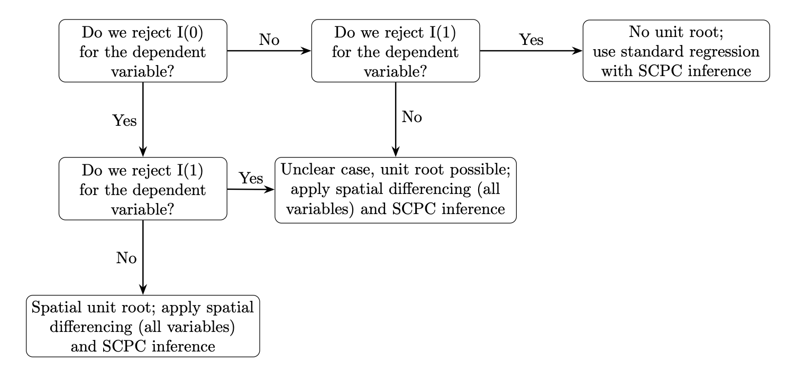

Project Website

# Spatial persistence tooling, in one place

`spatial-spur` is the shared documentation hub for the SPUR and SCPC package
family across Python, R, and Stata.

This site documents the Becker, Boll and Voth (2026) implementation of the
spatial unit root procedure introduced in Müller and Watson (2024).

[Read the introduction](#spatial-unit-roots){ .md-button .md-button--primary }
[Start with spur-skills](spur-skills/index.md){ .md-button }

  <a class="surface-card" href="spur-skills/">
    Setup
    <h3>spur-skills</h3>
    
Install the shared skills that help agents navigate the ecosystem.

  </a>
  <a class="surface-card" href="spuR/">
    R
    <h3>spuR</h3>
    
R-side docs for SPUR diagnostics and related workflow guidance.

  </a>
  <a class="surface-card" href="spur-python/">
    Python
    <h3>spur-python</h3>
    
Python docs for running SPUR in a modern workflow.

  </a>
  <a class="surface-card" href="spur-stata/">
    Stata
    <h3>spur-stata</h3>
    
Stata docs for the original SPUR workflow and parity-oriented usage.

  </a>
  <a class="surface-card" href="scpcR/">
    R
    <h3>scpcR</h3>
    
R docs for SCPC inference, model support, and result interpretation.

  </a>
  <a class="surface-card" href="scpc-python/">
    Python
    <h3>scpc-python</h3>
    
Python docs for SCPC workflows alongside the broader SPUR toolchain.

  </a>

## Spatial unit roots

Mueller-Watson (2024) show that in many empirical settings, the decay rate of spatial dependence is so slow
that standard techniques like HAC error corrections do not suffice to prevent spurious regression results. Drawing 
on time-series econometrics, they call such settings `spatial unit roots` and propose and develop the spatial equivalent
to an `I(0)` and `I(1)` unit-root tests and first-differencing transformations as solutions. 

Based on that, Becker, Boll, and Voth (2026) propose a simple decision tree to test for and remove this spatial dependence
using the tools of Mueller-Watson (2024):

*Decision rule from Becker, Boll, and Voth (2026), based on Müller and Watson
(2024).*

## The spur-scpc ecosystem

The spur/scpc ecosystem of packages provide a simple, homogenous interface to this workflow by
translating all the tests Mueller-Watson proposed to Stata, R, and Python. 

- The SPUR packages provide the unit-root diagnostics, residual tests, half-life procedure, and spatial transformations.
- The SCPC packages provide the inference layer developed in Müller and Watson (2022, 2023). 

The core SPUR functions are:

- **`I(0)` test**: tests the null that the variable is `I(0)`.
- **`I(1)` test**: tests the null that the variable is `I(1)`.
- **`I(0) residual` test**: applies the `I(0)` test to fitted regression residuals.
- **`I(1) residual` test**: applies the `I(1)` test to fitted regression residuals.
- **`spurtransform`**: applies the spatial transformation used to remove the low-frequency component.
- **`spurhalflife`**: reports confidence sets for the spatial half-life.

SCPC is a single post-estimation function: 

- **`scpc()`**: applies a post-estimation correction to a fitted model

## References

- Becker, Sascha O., P. David Boll, and Hans-Joachim Voth (2026). “Testing and Correcting for Spatial Unit Roots in Regression Analysis.” *Stata Journal*, forthcoming.
- Müller, Ulrich K., and Mark W. Watson (2024). “Spatial Unit Roots and Spurious Regression.” *Econometrica* 92(5): 1661–1695.
